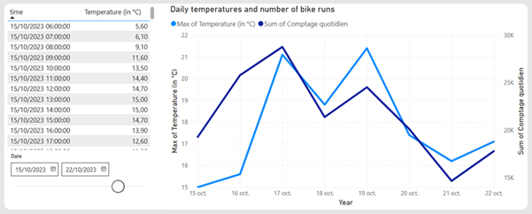
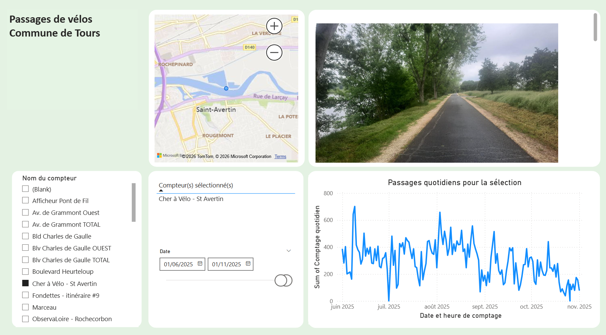
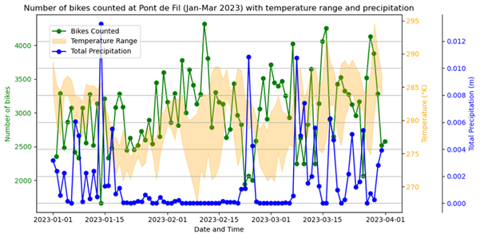

# tours_bikes
How many bikes are going to ride tomorrow in Tours ? A data science project, with Power BI visualisations

# Analyse des passages de vélos à Tours : Visualisations Power BI & prédictions data science

[]
[]
[]

---
**English version below.**

---
---

## Pourquoi ce projet ?
**Comment la météo influence-t-elle les déplacements à vélo à Tours ?**
Ce projet explore la corrélation entre les conditions météorologiques (température, pluie, vent, neige) et la fréquentation des pistes cyclables, à partir des données ouvertes de la métropole de Tours et des relevés Copernicus.
**Objectif** : Visualiser les tendances, prédire la fréquentation quotidienne et pourquoi pas aider les collectivités à optimiser les interventions sur infrastructures cyclables.

---

## Insights clés

### 1. Température et fréquentation
Echantillon pour visualiser l'influence de la variation de température 15°C et 22°C : du 15 au 22 octobre 2023, la courbe des passages évolue comme celle des températures maximales.

### 2. Impact de la pluie
Les précipitations réduisent significativement la fréquentation. Une mesure DAX a été créée pour amplifier la visibilité des faibles précipitations (0 → 0.001 mm/h).

### 3. Visualisation interactive
Tableau de bord Power BI permettant de filtrer par compteur, date et conditions météo, avec intégration de cartes et photos des sites.

---

## Méthodologie & outils

### 1. Sources de données
- **Fréquentation vélo** : [Open Data Tours Métropole](https://data.tours-metropole.fr/explore/dataset/comptage-velo-compteurs-syndicat-des-mobilites-de-touraine/)
- **Météo** : [Copernicus ERA5](https://cds.climate.copernicus.eu/) (température, pluie, vent, neige)

### 2. Traitement des données
- **Power Query** : Conversion des températures (K → °C), agrégation horaire → quotidienne.
- **Python** : Nettoyage, feature engineering (weekend, jours fériés), gestion des outliers.

### 3. Modélisation prédictive
- **Modèle** : LightGBM (MAE = 4010, résultats satisfaisants pour une prédiction quotidienne).
- **Features** : Températures min/max, précipitations, vent, weekend, vacances scolaires.
- **Améliorations possibles** : Ajout de lag, dichotomie des jours de semaine, événements spéciaux.

![Feature engineering et prédictions]

---

## Pour les experts

### Détails techniques
- **Power BI** : Modèle de données simple, mesures DAX pour les agrégations et visualisations.
- **Python** : Scripts de prédiction (`predict_bike_count.py`), gestion des quotas API Copernicus.
- **Risques de biais** : Données manquantes (pluie), compteurs activés en cours de période.

### Comment reproduire ?
1. Télécharger les datasets (liens ci-dessus).
2. Importer dans Power BI et appliquer les transformations Power Query.
3. Exécuter le notebook Jupyter pour la prédiction.

---

## Essayez par vous-même !
- **Fichier Power BI** : pbit disponible dans le dépôt. (pbix sur demande par email).
- **Code Python** : Disponible dans le dépôt.

---

## Contact
Value Discovery – [contact@valuediscovery.fr](mailto:contact@valuediscovery.fr) | Conseil informatique et enseignement.

---

---

# Bike traffic analysis in Tours: Power BI visualizations & data science predictions

---

## Why This Project?
**How does weather influence bike traffic in Tours?**
This project explores the correlation between weather conditions (temperature, rain, wind, snow) and bike lane usage, using open data from Tours Métropole and Copernicus records.
**Goal**: Visualize trends, predict daily traffic, and why not: help local authorities optimize their operation on cycling infrastructure.

---

## Key insights

### 1. Temperature and bike traffic
Sample to visualize the influence of temperature variation between 15°C and 22°C: from October 15 to 22, 2023, the bike traffic curve follows the maximum temperature curve.

### 2. Impact of rain
Precipitation significantly reduces bike traffic. in Power BI, A DAX measure was created to amplify the visibility of low precipitation (0 → 0.001 mm/h).

### 3. Interactive visualization
Power BI dashboard allowing filtering by counter, date, and weather conditions, with maps and site photos.

---

## Methodology & tools

### 1. Data sources
- **Bike Traffic**: [Tours Métropole Open Data](https://data.tours-metropole.fr/explore/dataset/comptage-velo-compteurs-syndicat-des-mobilites-de-touraine/)
- **Weather**: [Copernicus ERA5](https://cds.climate.copernicus.eu/) (temperature, rain, wind, snow)

### 2. Data processing
- **Power Query**: Temperature conversion (K → °C), hourly to daily aggregation.
- **Python**: Cleaning, feature engineering (weekend, holidays), outlier management. DataViz.

### 3. Predictive modeling
- **Model**: LightGBM (MAE = 4010, satisfactory results for daily prediction).
- **Features**: Min/max temperatures, precipitation, wind, weekend, school holidays.
- **Possible Improvements**: Add lag, dichotomize weekdays, special events.

---

## For experts

### Technical details
- **Power BI**: Simple data model, DAX measures for aggregations and visualizations.
- **Python**: Prediction scripts (`predict_bike_count.py`), Copernicus API quota management.
- **Bias Risks**: Missing data (rain), counters activated during the period.

### How to reproduce?
1. Download datasets (links above).
2. Import into Power BI and apply Power Query transformations.
3. Run the Jupyter notebook for prediction.

---

## Try It Yourself!
- **Power BI File**: .pbit available in the repository. (.pbix file available upon request via email).
- **Python Code**: Available in the repository.

## Contact
Value Discovery – [contact@valuediscovery.fr](mailto:contact@valuediscovery.fr) | Consulting and training.

**Licence** : MIT – Libre réutilisation et adaptation.

