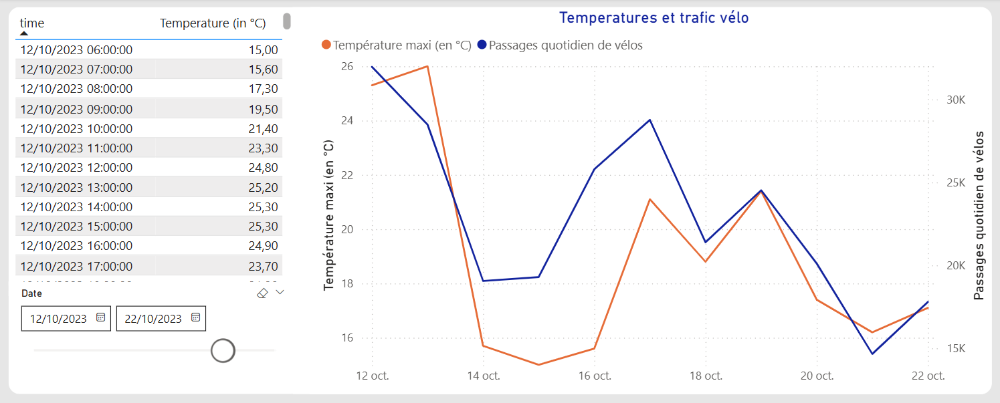

# Passages de vélos à Tours : Visualisations Power BI & prédictions data science

[]
[]
[]

---

## Pourquoi ce projet ?
**Comment la météo influence-t-elle les déplacements à vélo à Tours ?**
Ce projet explore la corrélation entre les conditions météorologiques (température, pluie, vent, neige) et la fréquentation des pistes cyclables, à partir des données ouvertes de la métropole de Tours et des relevés Copernicus.
**Objectif** : Visualiser les tendances, prédire la fréquentation quotidienne et pourquoi pas aider les collectivités à optimiser les interventions sur infrastructures cyclables.

---

## Insights clés

### 1. Température et fréquentation
Echantillon pour visualiser l'influence de la variation de température 15°C et 22°C : du 15 au 22 octobre 2023, la courbe des passages évolue comme celle des températures maximales.

### 2. Impact de la pluie
Les précipitations réduisent significativement la fréquentation. Une mesure DAX a été créée pour amplifier la visibilité des faibles précipitations (0 → 0.001 mm/h).

### 3. Visualisation interactive
Tableau de bord Power BI permettant de filtrer par compteur, date et conditions météo, avec intégration de cartes et photos des sites.

---

## Méthodologie & outils

### 1. Sources de données
- **Fréquentation vélo** : [Open Data Tours Métropole](https://data.tours-metropole.fr/explore/dataset/comptage-velo-compteurs-syndicat-des-mobilites-de-touraine/)
- **Météo** : [Copernicus ERA5](https://cds.climate.copernicus.eu/) (température, pluie, vent, neige)

### 2. Traitement des données
- **Power Query** : Conversion des températures (K → °C), agrégation horaire → quotidienne.
- **Python** : Nettoyage, feature engineering (weekend, jours fériés), gestion des outliers.

### 3. Modélisation prédictive
- **Modèle** : LightGBM (MAE = 4010, résultats satisfaisants pour une prédiction quotidienne).
- **Features** : Températures min/max, précipitations, vent, weekend, vacances scolaires.
- **Améliorations possibles** : Ajout de lag, dichotomie des jours de semaine, événements spéciaux.

![Feature engineering et prédictions]

---

## Pour les experts

### Détails techniques
- **Power BI** : Modèle de données simple, mesures DAX pour les agrégations et visualisations.
- **Python** : Scripts de prédiction (`predict_bike_count.py`), gestion des quotas API Copernicus.
- **Risques de biais** : Données manquantes (pluie), compteurs activés en cours de période.

### Comment reproduire ?
Voir projet github : [tours_bikes](https://github.com/dfrome2/tours_bikes)

---

## Contact
Value Discovery – [contact@valuediscovery.fr](mailto:contact@valuediscovery.fr) | Conseil informatique et enseignement.

---
Licence: GNU3